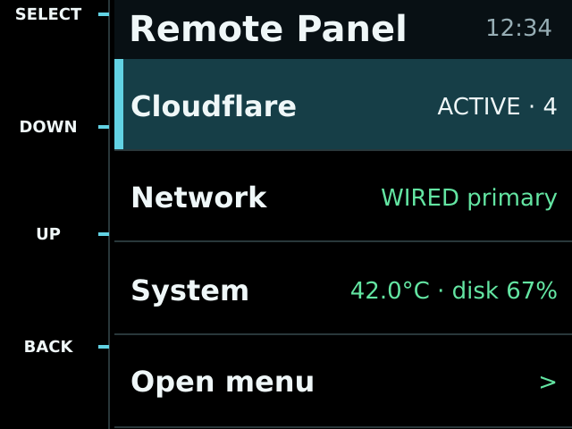

# PiTFT OOB Panel

PiTFT OOB Panel is a local-first, black-background status interface and guarded
control-plane architecture for Raspberry Pi out-of-band management appliances.
It targets the Adafruit PiTFT Plus 2.8-inch resistive display while keeping
hardware, status providers, navigation, rendering, and privileged actions
separate.



This repository contains no tunnel credentials, SSH keys, site hostnames,
addresses, SSIDs, or captures from a deployed appliance. Tunnel provisioning is
deliberately outside the project.

## Current scope

- 320x240 black-theme interface with a left-side rail aligned to the four HAT buttons.
- Paged status menu whose touch hitboxes and physical-button selection share one layout.
- Built-in PiTFT Plus 2.8-inch rotation-270 hardware profile.
- Immutable, typed status observations with explicit health and freshness.
- Separate controller, renderer, Linux adapters, providers, and safe action catalog.
- A simulator that renders synthetic data without Raspberry Pi hardware.
- Privileged controls disabled by default; no arbitrary shell commands or
  plugin-provided privileged commands.

The project is alpha software. Treat the display as an operational aid, not the
sole source of truth for service health.

## Network safety

This project observes `cloudflared`; it does not provision or authorize a
tunnel. An outbound tunnel is still a remote-access path. In particular, an
authorized SSH session can originate connections from the appliance even when
kernel IP forwarding is disabled.

Keep the tunnel stopped while the appliance is on a temporary, home, staging,
or otherwise unintended LAN. Before enabling it at the destination, audit its
published applications, private CIDR routes, WARP routing, Access policy, and
SSH keys. See the [bench-network procedure](docs/operations.md#bench-network-safety).

## Quick start: simulator

```bash
python -m venv .venv
. .venv/bin/activate
python -m pip install -e .
pitft-oob-panel simulate --output panel.png
```

On Windows, activate with `.venv\Scripts\activate`. The generated image uses
synthetic identifiers only.

## Validate a configuration

```bash
pitft-oob-panel validate-config config/default.toml
```

Configuration does not accept shell snippets. Hardware button locations and
logical actions come from versioned profiles documented in
[docs/hardware-profiles.md](docs/hardware-profiles.md).

## Raspberry Pi status

The Linux framebuffer and evdev adapters are included, but installation is not
yet declared production-ready. The packaging files are intentionally a scaffold
until the dedicated service-account and privileged-broker threat model is
implemented and hardware-tested on both armhf and arm64.

Read [the architecture](docs/architecture.md), [threat model](docs/threat-model.md),
and [operations guide](docs/operations.md) before deploying.

## Development

```bash
python -m pip install -e ".[dev]"
pytest
ruff check .
ruff format --check .
mypy src
python -m build
pip-audit --strict .
```

See [CONTRIBUTING.md](CONTRIBUTING.md) and [SECURITY.md](SECURITY.md).
The current publication decision and remaining release gates are recorded in
[the pre-publication review](docs/pre-publication-review.md).

## Hardware acknowledgement

Adafruit and PiTFT are trademarks of their respective owners. The button
coordinates in the bundled profile are derived from Adafruit's publicly
available PiTFT Plus 2.8-inch EagleCAD design. Adafruit hardware design files
are not redistributed here.

## License

Apache License 2.0. See [LICENSE](LICENSE).
